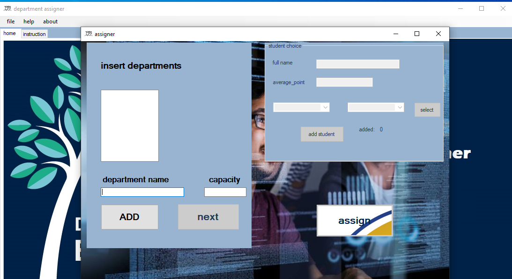

# Department-Assigner
department assigner is a windows application that assign department for students based on their choice.
the app user opens the app and insert the students mark and their choices along with a department list. The app automatically assign  department for every students based on student choice and their mark. 

- <mark>the app only shows and store the result on sql server database but it doesnt support all the crud operations.</mark>
- please support the repo by contributing🙏🙏🙏🙏🙏🙏🙏🙏🙏🙏🙏🙏🙏🙏🙏!
*************

## components 
- windows form(c#)
- microsoft sql server 

## structure 
* The execution begins from the program.cs file which will launch admin form. 
* To change the database connection setting go to connection.cs file and replace the connection 
string with your own connection string.
* The assigning process is done in emmitor.cs file. 
* The student class holds the student object 
* compairer.cs file is a class that extends icompairer for just compairing two students class 

